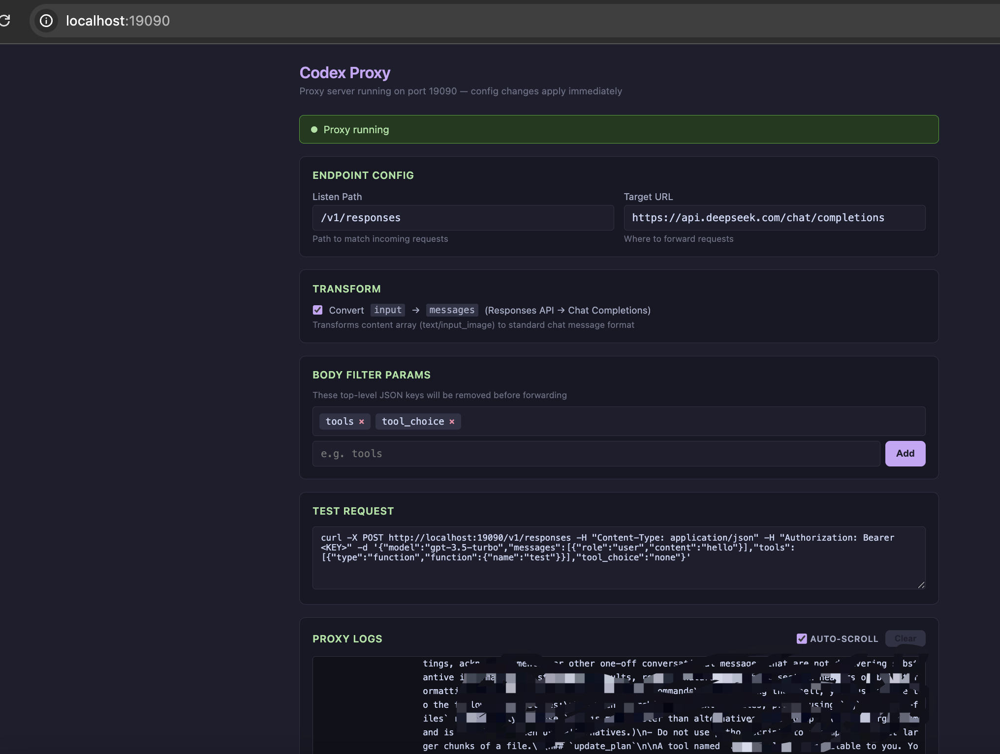

# Codex Proxy Req

[English](README_EN.md) | 中文

## ⚠️ 警告

**本项目仅供本地学习和技术研究使用。**

- 请勿用于任何违反法律法规、服务商条款或侵犯他人权益的场景
- 请勿在生产环境中使用此代理工具
- 使用者需自行承担所有风险和责任
- 本项目不提供任何形式的担保或保证

## 项目介绍
本项目仅本地测试体验 codex 使用（其实也没啥好的体验😤），请勿违反当地法律法规，违者后果自负。

## 如何把 codex 内置的模型改为国内或者本地的
  [看这里](codex_local.md)

## 功能说明
codex 使用的 `/v1/responses` 接口，国内模型厂商目前（26-05-22）不支持，给准备体验 codex 的人极差的感受（🪜，💰）。
这个工具目标是简单代理请求，然后把不支持的参数过滤和转为 chat 补全接口能识别的，然后让兄弟们能
体验阉割版（不支持工具）的 codex（体验极差🐶），希望国内厂商赶紧出带工具的 responses 接口。

顺便让兄弟们看看 codex 的 token 是如何消费掉的，系统提示词咋写的。

## 原理简单描述（deepseek 版本）
代理请求工具，将 `http://localhost:19090/v1/responses` 的请求代理转发到目标 API，并**动态过滤请求体中的指定字段**，把 input、instructions 等参数转为 message；输出的 choices 转为 output。

## 快速开始

```bash
npm install
npm start
```

访问 `http://localhost:19090/` 打开配置界面。

## 使用方式

```bash
# 仅代理服务，浏览器访问 http://localhost:19090/ 配置
npm start

# 代理服务 + Electron 桌面配置窗口
npm run start:ui
```

### curl 示例

```bash
curl -X POST http://localhost:19090/v1/responses \
  -H "Content-Type: application/json" \
  -H "Authorization: Bearer <YOUR_API_KEY>" \
  -d '{
    "model": "gpt-3.5-turbo",
    "messages": [{"role": "user", "content": "hello"}],
    "tools": [{"type": "function", "function": {"name": "test"}}],
    "tool_choice": "none"
  }'
```

实际转发到目标 API 的 body 会自动移除 `tools` 和 `tool_choice`，只保留 `model` 和 `messages`。

## 动态配置

在 Web 配置界面可实时修改（无需重启）：

- **监听路径** — 匹配入站请求的 path，默认 `/v1/responses`
- **目标 URL** — 转发目标地址，默认 `https://api.deepseek.com/chat/completions`
- **过滤参数** — 从 body 中移除的 JSON key，默认 `tools, tool_choice`

## API

| 方法 | 路径 | 说明 |
|------|------|------|
| `GET` | `/` | 配置界面 |
| `GET` | `/api/config` | 获取当前配置 |
| `POST` | `/api/config` | 更新配置 `{"listenPath":"...","targetUrl":"...","filterParams":[...]}` |
| `POST` | `/v1/responses` | 代理端点（路径可配） |

## 打包分发

### 方案一：electron-builder（推荐，完整桌面应用）

安装打包工具：

```bash
npm install --save-dev electron-builder
```

在 `package.json` 添加 build 配置和脚本：

```json
{
  "build": {
    "appId": "com.codex.proxy-req",
    "productName": "Codex Proxy",
    "files": ["server.js", "start-electron.js", "node_modules/**/*"],
    "mac": {
      "target": ["dmg", "zip"],
      "category": "public.app-category.developer-tools"
    },
    "win": {
      "target": ["nsis", "portable"]
    },
    "linux": {
      "target": ["AppImage", "deb"],
      "category": "Development"
    },
    "nsis": {
      "oneClick": false,
      "allowToChangeInstallationDirectory": true
    }
  },
  "scripts": {
    "pack": "electron-builder --dir",
    "dist": "electron-builder",
    "dist:mac": "electron-builder --mac",
    "dist:win": "electron-builder --win",
    "dist:linux": "electron-builder --linux"
  }
}
```

打包命令：

```bash
# 当前平台打包
npm run dist

# 按平台打包
npm run dist:mac      # → dist/*.dmg
npm run dist:win      # → dist/*.exe
npm run dist:linux    # → dist/*.AppImage
```

macOS 签名（可选，不签名也能用但会有安全提示）：

```bash
# 跳过签名直接打包
CSC_IDENTITY_AUTO_DISCOVERY=false npm run dist:mac
```

### 方案二：pkg（轻量级，纯 CLI 无 GUI）

适合只需要代理服务、不需要桌面配置窗口的场景：

```bash
npm install -g pkg
pkg server.js --targets node18-macos-arm64,node18-win-x64,node18-linux-x64
```

输出单文件可执行程序，直接运行即启动代理服务，浏览器打开 `http://localhost:19090/` 进行配置。

### 方案三：直接分发源码

目标机器安装 Node.js 18+ 后：

```bash
npm install --production
npm start
```

三行即可启动，适合开发者之间分发。

### 跨平台注意事项

| 平台 | Electron 窗口 | 配置方式 |
|------|-------------|---------|
| macOS | `open -a Electron.app` 打开窗口 | 自动弹出 Electron 窗口 |
| Windows | 需确保 Electron.exe 路径正确 | 浏览器访问 `http://localhost:19090/` |
| Linux | `xdg-open` 或 Electron 二进制 | 浏览器访问 `http://localhost:19090/` |

如果在非 macOS 平台 Electron 窗口启动失败，配置界面仍可通过浏览器正常使用。

## 截图效果（没有工具，基本废了）
### 代理配置


### codex 桌面配置界面


### codex 终端


## 许可证

[MIT](LICENSE)
