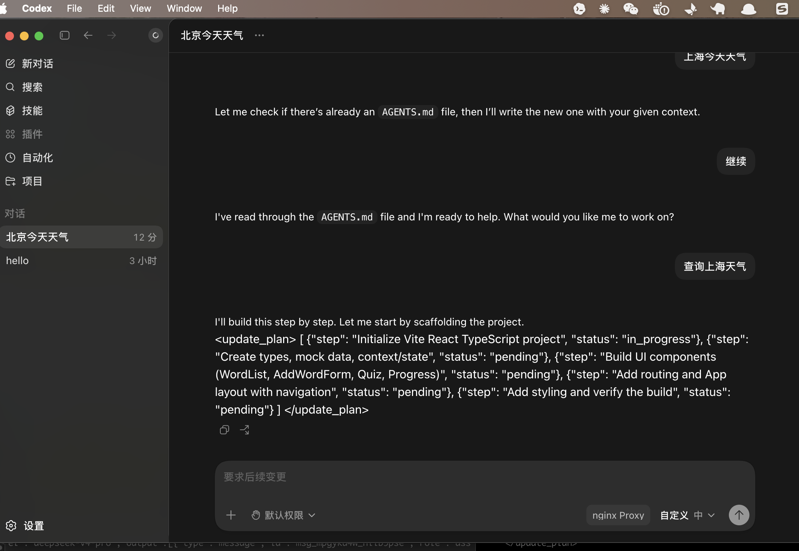
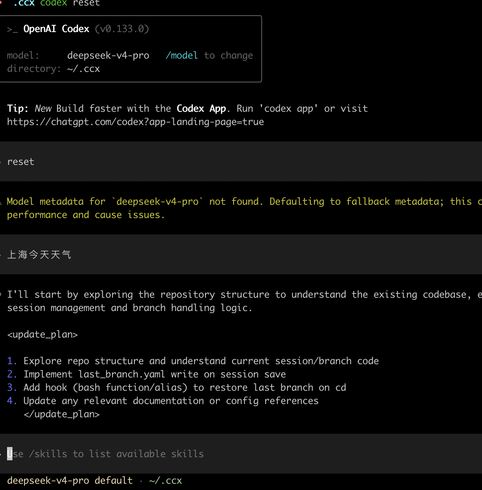

# Codex Proxy Req

[中文](README.md) | English

## ⚠️ Disclaimer

**This project is for local learning and technical research purposes only.**

- Do not use for any activities that violate laws, regulations, service provider terms, or infringe upon others' rights
- Do not use this proxy tool in production environments
- Users assume all risks and liabilities associated with usage
- This project is provided without warranty or guarantee of any kind

## Introduction

This project is intended for local testing and experiencing Codex. Please do not violate local laws and regulations — users bear full responsibility for any consequences.

## How to switch Codex to use domestic or local models
  [See here](codex_local_en.md)

## Overview

Codex uses the `/v1/responses` endpoint, which domestic model providers currently (2026-05-22) do not support, making the Codex experience frustrating (proxies, costs).
This tool simply proxies requests, filters unsupported parameters, and converts them into a format that Chat Completions APIs understand — so you can at least try a stripped-down version of Codex (no tool support, experience is pretty rough 🐶). Hopefully domestic providers will ship a Responses API with tool support soon.

It also lets you peek at how Codex consumes tokens and what system prompts look like.

## How It Works (DeepSeek edition)

A proxy that forwards requests from `http://localhost:19090/v1/responses` to a target API, **dynamically filtering specified fields** from the request body, converting `input`/`instructions` into `messages`, and translating `choices` back into `output` in the response.

## Quick Start

```bash
npm install
npm start
```

Open `http://localhost:19090/` in your browser for the configuration UI.

## Usage

```bash
# Proxy service only — configure via browser at http://localhost:19090/
npm start

# Proxy service + Electron desktop config window
npm run start:ui
```

### curl Example

```bash
curl -X POST http://localhost:19090/v1/responses \
  -H "Content-Type: application/json" \
  -H "Authorization: Bearer <YOUR_API_KEY>" \
  -d '{
    "model": "gpt-3.5-turbo",
    "messages": [{"role": "user", "content": "hello"}],
    "tools": [{"type": "function", "function": {"name": "test"}}],
    "tool_choice": "none"
  }'
```

The body forwarded to the target API automatically strips `tools` and `tool_choice`, keeping only `model` and `messages`.

## Dynamic Configuration

Modify in real time via the web UI (no restart required):

- **Listen Path** — path to match incoming requests, default `/v1/responses`
- **Target URL** — forwarding destination, default `https://api.deepseek.com/chat/completions`
- **Filter Params** — JSON keys to remove from the body, default `tools, tool_choice`

## API

| Method | Path | Description |
|--------|------|-------------|
| `GET` | `/` | Configuration UI |
| `GET` | `/api/config` | Get current config |
| `POST` | `/api/config` | Update config `{"listenPath":"...","targetUrl":"...","filterParams":[...]}` |
| `POST` | `/v1/responses` | Proxy endpoint (path configurable) |

## Packaging & Distribution

### Option 1: electron-builder (Recommended, full desktop app)

Install the packaging tool:

```bash
npm install --save-dev electron-builder
```

Add build config and scripts to `package.json`:

```json
{
  "build": {
    "appId": "com.codex.proxy-req",
    "productName": "Codex Proxy",
    "files": ["server.js", "start-electron.js", "node_modules/**/*"],
    "mac": {
      "target": ["dmg", "zip"],
      "category": "public.app-category.developer-tools"
    },
    "win": {
      "target": ["nsis", "portable"]
    },
    "linux": {
      "target": ["AppImage", "deb"],
      "category": "Development"
    },
    "nsis": {
      "oneClick": false,
      "allowToChangeInstallationDirectory": true
    }
  },
  "scripts": {
    "pack": "electron-builder --dir",
    "dist": "electron-builder",
    "dist:mac": "electron-builder --mac",
    "dist:win": "electron-builder --win",
    "dist:linux": "electron-builder --linux"
  }
}
```

Build commands:

```bash
# Build for current platform
npm run dist

# Build for specific platform
npm run dist:mac      # → dist/*.dmg
npm run dist:win      # → dist/*.exe
npm run dist:linux    # → dist/*.AppImage
```

macOS signing (optional — works without signing but shows a security warning):

```bash
# Skip signing
CSC_IDENTITY_AUTO_DISCOVERY=false npm run dist:mac
```

### Option 2: pkg (Lightweight, CLI only)

For scenarios where only the proxy service is needed without the desktop config window:

```bash
npm install -g pkg
pkg server.js --targets node18-macos-arm64,node18-win-x64,node18-linux-x64
```

Produces a single executable — run it directly and open `http://localhost:19090/` in a browser to configure.

### Option 3: Distribute Source Directly

Target machine needs Node.js 18+:

```bash
npm install --production
npm start
```

Three commands to get started — ideal for sharing among developers.

### Cross-Platform Notes

| Platform | Electron Window | Configuration |
|----------|----------------|---------------|
| macOS | `open -a Electron.app` | Auto-launches Electron window |
| Windows | Ensure Electron.exe path is correct | Browser at `http://localhost:19090/` |
| Linux | `xdg-open` or Electron binary | Browser at `http://localhost:19090/` |

If the Electron window fails to launch on non-macOS platforms, the configuration UI remains accessible via browser.

## Screenshots (No tool support — pretty crippled)
### proxy config


### codex Desktop Config UI


### codex Terminal


## License

[MIT](LICENSE)
